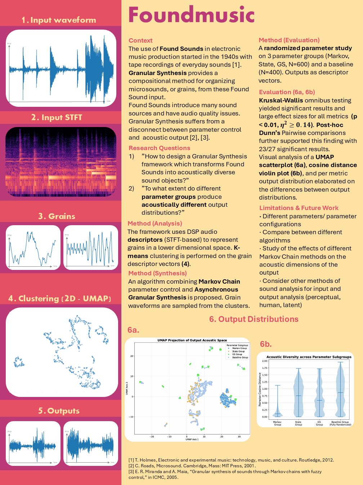

# Foundmusic

Bsc thesis repository for sound analysis and synthesis

# 1. Thesis Poster
<!--  -->


# 2. Usage
Currently only usage supported is the running of trails + evaluations. 

## Run Trials

```bash
cd src/grains
```

Run the trials file. Specific pilot_study directory must first be created with a Found Sound input.wav. Also make sure to have the correct file path to this dir

```bash
python trials.py
```

**NOTE:** variables marked with ```_variable_name``` underscore should not be modified without knowledge of the function parameters. 

## Run Evaluations

```bash
cd src/grains
```

Run the evaluation_narrow file. Specific pilot_study directory must first be selected. The correct pilot study generated by the trials.py must be taken from the subfolder. It corresponds to the time of running the trials. 

```bash
python evaluation_narrow.py
```

## Run Simple HTML Audio Demo's

```bash
cd src/frontend
python -m http.server
```
go to a browser and navigate to http://localhost:8000/


# Output
- Input analysis figures
- Output analysis figures
- Statistical results
- Trial logs
- Trial parameters


