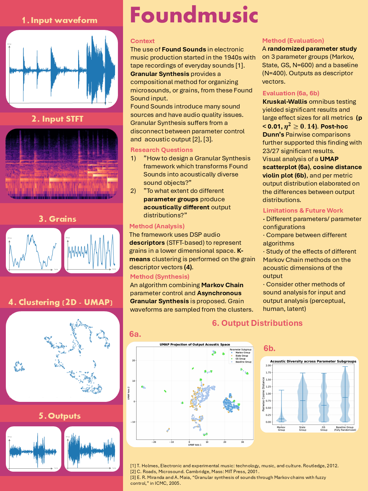

# Foundmusic

Bsc thesis repository for sound analysis and synthesis

# 1. Thesis Poster
<!--  -->


# 2. Usage
Currently only usage supported is the running of trails + evaluations. 

## Run Trials

```bash
cd src/grains
```

Run the trials file. Specific pilot_study directory must first be created with a Found Sound input.wav. Also make sure to have the correct file path to this dir

```bash
python trials.py
```

**NOTE:** variables marked with ```_variable_name``` underscore should not be modified without knowledge of the function parameters. 

## Run Evaluations

```bash
cd src/grains
```

Run the evaluation_narrow file. Specific pilot_study directory must first be selected. The correct pilot study generated by the trials.py must be taken from the subfolder. It corresponds to the time of running the trials. 

```bash
python evaluation_narrow.py
```

## Run Simple HTML Audio Demo's

```bash
cd src/frontend
python -m http.server
```
go to a browser and navigate to http://localhost:8000/

## Modules

### Algorithms
Contains the canonical algorithms used in this research 
The ```MarkovGranulizer``` class supports currently ```run_v3```
used in the ```trials.py``` script. 

### Analysis 
- Contains the AnalyzerObject class that allows for analysis of input audio, 
grain descriptor computation, data scaling
- Contains visualization functions used in ```evaluation_narrow.py```

### Helpers
- Contains the helper functions such as amplitude envelopes and the audio array normalization

### Slicing
- Contains wrappers for the FluCoMa CLI toolkit, not used in the trials

### Writing
- Contains hashing and saving of audio + metadata

### Trials
- Contains script to produce N total samples for K random seeds per configuration
- It is designed for specific trial setup where Markov/ State/ and GS groups are considered
- Saves the trial parameters, the parameter configuration values, the output data (audio + metadata), the output metric data

### Evaluation + Evaluation Narrow
- Evaluation is the first iteration and attempt at running visual + statistical analysis
- Evaluation narrow is the current used method
    - Contains stat testing with Kruskal Wallis, Posthoc Dunns
    - Contains visual analysis of metric distributions with KDE plots / histograms
    - Contains visual analysis of output cosine distances via BOX / VIOLIN plots
    - Contains UMAP visualization of outputs (2-component)

## Notebooks
There are several notebooks which were used to:
- develop methods functions classes
- iterate through algorithms and parameters
- experiment with sound input and output
- test analysis methods

Further details per notebook are included in **docs/notebook_logs.md**

# Output
- Input analysis figures
- Output analysis figures
- Statistical results
- Trial logs
- Trial parameters


